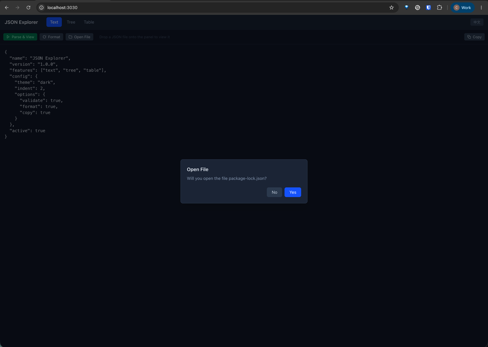
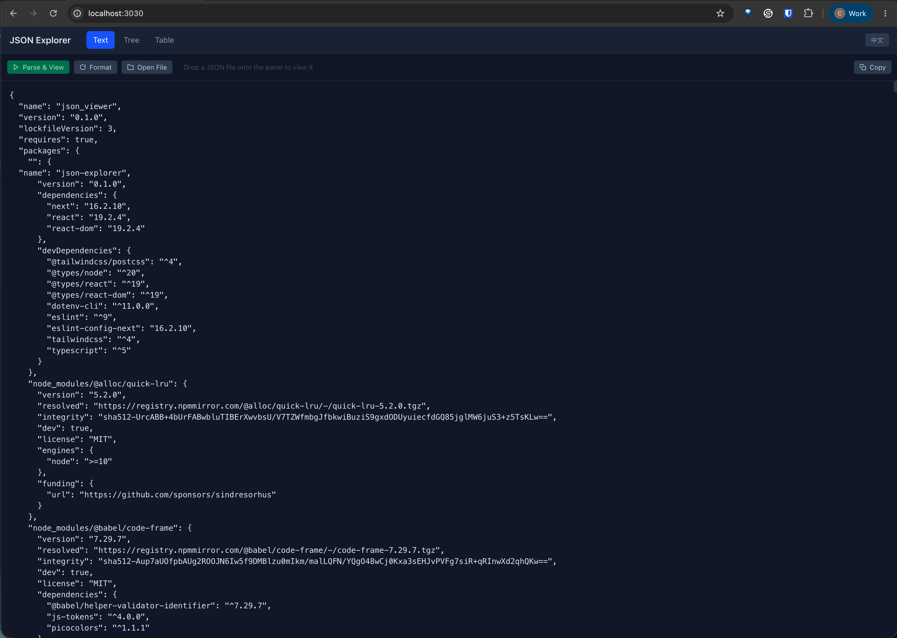
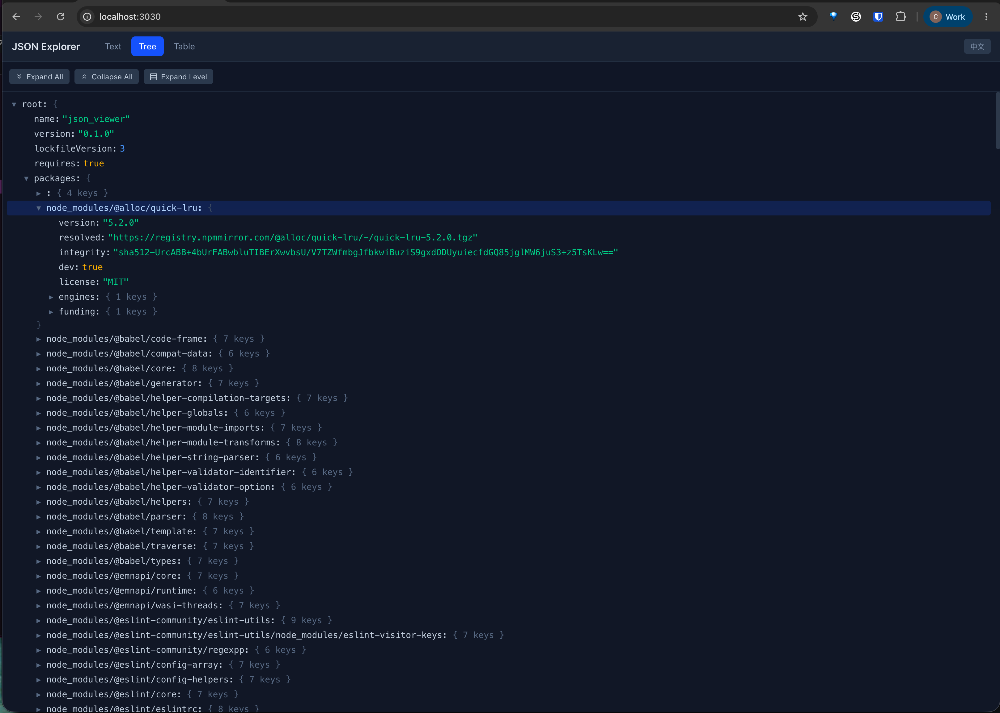
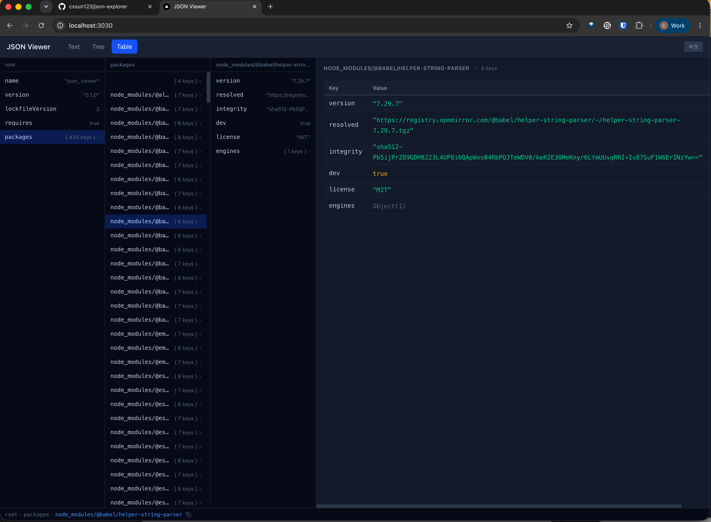

# JSON Explorer

An online JSON file parser and viewer with Text, Tree, and Table views.

Built with [Next.js](https://nextjs.org) (App Router) + [Tailwind CSS](https://tailwindcss.com).

## Screenshots



**File drop & open** — drag-and-drop `.json`/`.jsonc` files anywhere, or open via file picker; auto-parses on load.

---



**Text view** — edit, format, parse, copy, and validate JSON with toolbar actions.

---



**Tree view** — expand/collapse to any level, node selection, toolbar actions (expand all / collapse all / expand to level).

---



**Table view** — multi-column browser with resizable columns, detail panel, clickable path breadcrumb with copy.

## Getting Started

Copy `.env.example` to `.env` and customize:

```bash
cp .env.example .env
npm install
npm run dev
```

Open [http://localhost:3000](http://localhost:3000). To use a different port, set `PORT` in `.env` (e.g. `PORT=3030`).

## Build

```bash
npm run build
npm start
```

The production server respects the `PORT` environment variable.

## Docker

```bash
docker compose --env-file .env up -d --build
```

## Project Structure

```
src/
├── app/              # Next.js App Router pages & layout
│   ├── globals.css
│   ├── layout.tsx
│   └── page.tsx
├── components/       # React components
│   ├── ConfirmModal.tsx
│   ├── TableView.tsx
│   ├── TextView.tsx
│   └── TreeView.tsx
└── lib/              # Utilities
    ├── jsonUtils.ts
    └── locales/
        ├── en.ts
        ├── zh.ts
        └── LocaleContext.tsx
```

## License

MIT
